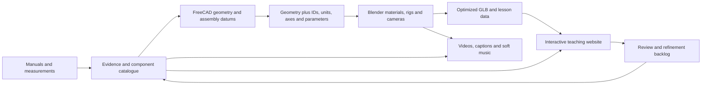

# 4212PistonEngine — development blueprint

Status (9 September 2026): the GitHub Pages prototype loads all 60 cylinder components directly from the synced Google Drive GLB through the official Drive API. Orbit, zoom, selection, functions and isolation have been verified. Operating web animation and the complete CAD-edit propagation pipeline remain to be built. The current FreeCAD and Blender files remain in `../EngineSimulation/`.

Start with [the project roadmap](docs/ROADMAP.md) for milestones, acceptance checks and working priorities. This document supplies technical architecture; the roadmap controls milestone names and status.

The objective is a reusable teaching platform in which students can inspect components, operate mechanisms, follow systems and test their understanding. Start with one complete cylinder workflow and extend it through linked engine subassemblies.



## 1. One owner for each kind of information

| Information | Authoritative owner | Downstream use |
|---|---|---|
| Engine variant, source claims, part identity, names and functions | Shared catalogue and evidence records | Tooltips, captions, lessons, review reports |
| Geometry, dimensions, assembly locations and joint axes | FreeCAD | Blender meshes and rig anchors |
| Materials, lighting, cameras, presentation rigs | Blender | Video renders and web assets |
| Picking, isolation, clipping, UI, lesson state and music toggle | Website | Student interaction |
| Measured timing or declared illustrative timing | Versioned operation profile | Both Blender and web animation |

A generated mesh is not a second design master. Geometry fixes return to CAD. A wording correction goes into the catalogue once, then updates the website and video captions together.

## 2. The first milestone: a complete cylinder workflow

Deliver one page with orbit/pan/zoom, play/pause, speed and crank-angle controls, touch/click selection, an accessible component list, names/functions, opaque-part isolation, reset and an evidence badge. Include the three videos as a fallback. Music is soft and user-controlled; no automatic audible playback on page load.

Current stack: a static JavaScript website with Three.js and GLB assets. TypeScript remains an optional future implementation choice. Three.js gives direct control over component selection, materials, clipping and animation. A simpler model-viewer page can provide an early orbit/play preview, but the planned inspection and lesson controls justify a custom viewer.

Acceptance is an actual change-propagation exercise, not just a successful export:

1. Use a copy of the CAD master to change a fin dimension, then a mechanism parameter such as rod length.
2. Run the same build command to regenerate the affected geometry and operation data.
3. Confirm the changed geometry and dimensions in Blender and the browser.
4. Confirm that component selection, names, materials and lesson bindings still identify the same parts.
5. Compare mechanism positions at agreed crank angles; review new interferences.
6. Publish only the coherent, tested asset revision. Revert the test changes in the disposable copy.

The current CAD-to-Blender mesh updater already preserves object identities, materials and animation bindings. However, several video scripts still contain fixed valve anchors and reference dimensions. Those must move into the CAD export/operation manifest before the entire process can honestly be described as automatic. Changes to topology, joint axes or assembly interfaces still need an engineering review.

## 3. The exchange contract

Each exported part needs a stable definition ID, its existing CAD ID, units, parent assembly, material class, geometry revision and source references. Actual manufacturer part numbers are separate fields; leave them unknown until documented.

Distinguish a **part definition** from a **placed instance**. One barrel design may appear in six cylinder instances. Each instance has its own location and phase while reusing the same definition. Selection and lessons attach to stable IDs, never mesh-array order or an automatically suffixed Blender name.

Export named joint frames and mating datums with the geometry: crankshaft axis, crankpin centre, pin axis, cylinder axis, valve axes, rocker pivots, mounting planes, gear axes and fluid connection ports. Define an explicit transform from each local module frame into the engine frame. Keep the existing pilot's X/Y/Z convention until the full-engine datum convention has been checked, then record any conversion. CAD millimetres become web metres exactly once; also verify the glTF axis conversion.

A versioned release manifest should identify the CAD revision, catalogue revision, operation profile, tool versions, GLB/MP4 hashes and validation results. A web asset should never silently mix new geometry with an older timing or function catalogue.

## 4. Blender-to-web export needs its own checks

Use GLB for browser geometry, PBR materials and baked transform animations. Preserve stable IDs as custom properties/extras and in a separate catalogue. Test them after optimization: merging every mesh into one object would destroy per-component selection.

Do not assume every Blender feature survives export. Drivers and constraints need baking or an equivalent browser mechanism. Inspection transparency, clipping, gas tracers and phase colours should be implemented deliberately in the web viewer. Blender's compositing, video captions and arbitrary material animation are not the browser's user interface.

Use one crank-angle state for the whole operating model. Piston motion, valve events, cam speed, ignition cues and flow demonstrations derive from that state and the selected operation profile. Keep real timing profiles distinct from the current idealized 720-degree teaching cycle.

Use separate assets for subsystem lessons and load them on demand. Start with a measured mobile download/performance budget, compressed textures and a video/static fallback. Offer a low-detail mode and, later, an offline lesson pack. Browser selection should also work through a keyboard-accessible component list.

## 5. A manual-first production procedure

The repeatable procedure is detailed in [docs/manual-workflow.md](docs/manual-workflow.md):

**Identify applicability → inventory components and systems → record evidence → define interfaces → model → validate geometry → define motion → validate operation → export → test in the browser → release.**

Evidence confidence and validation are separate. A dimension may be directly documented while its surrounding casting contour is reconstructed. A motion demonstration may be smooth and internally consistent while using illustrative timing. Show both distinctions to instructors and students.

The seed catalogue in `data/component-registry.json` maps the current 60 CAD IDs to their teaching names/functions. It is a starting inventory, not a completed claim-by-claim engineering audit. `data/evidence-examples.json` demonstrates how to separate source values, selected modelling values and approximations.

## 6. Improve polish in useful stages

First improve readability: consistent lighting, camera framing, restrained colours, smooth eased transitions, stable captions, clear selected-part outlines and a clipping option when transparency becomes visually crowded. Preserve realistic steel, aluminium, bronze, ceramic and seal materials; use gold as a temporary selection cue.

Then improve surface realism with appropriate roughness, controlled highlights, convincing section faces and small visual edge treatments. Presentation-only detail must not be mistaken for a dimensioned CAD feature. Higher render resolution helps after geometry, lighting and framing are sound. Provide a neutral inspection mode alongside cinematic views.

Standardize the soft Quiet Workshop music, fades and volume controls. Preserve silent versions for live teaching. If narration is introduced, reduce music under speech and provide captions/transcripts.

Useful future visualizations, in increasing order of evidence/model demand:

| Study | What students can explore | Evidence/model requirement |
|---|---|---|
| Exploded assembly and part identification | Location, sequence, mating surfaces | Assembly drawings and verified local datums |
| Piston/rod kinematics | Position, velocity, acceleration versus angle | Verified geometry and declared speed |
| Valve timing and overlap | Lift and events on a crank-angle diagram | Applicable timing data; cam/lift data if claiming a real lift curve |
| Gear and accessory drives | Direction, speed ratios and power paths | Tooth counts, shaft layout and drive descriptions |
| Lubrication and cooling | Oil distribution/return, heat-rejection paths | Manual schematics; distinguish schematic routes from drilled galleries |
| Ignition, induction and exhaust | Timing, dual plugs and system connections | Applicable system descriptions and timing data |
| Clearances and faults | Lash, wear limits, leakage paths and diagnostic symptoms | Service limits and documented failure modes |
| Pressure, temperature and stresses | Quantitative physical behaviour | Explicit analytical/CFD/FEA models, assumptions and independent validation |

Do not infer quantitative temperature, pressure, flow rate or stress from an attractive animation.

## 7. Grow into a cumulative engine model

Establish the engine datum and interface register before producing many disconnected modules. Then use the following integration order:

1. **Cylinder study:** complete and prove the pipeline already under development.
2. **Crankshaft, bearings and crankcase:** establish the load-bearing skeleton, crankpin stations and mounting interfaces. Earlier V5 meshes are useful references, with their reconstruction limits retained.
3. **Six-cylinder installation:** place instances from the cylinder definition, with documented stations, orientation and firing phases.
4. **Camshaft and valve train:** connect lifters, pushrods and rockers to the common timing state.
5. **Reduction and accessory drives:** integrate shafts, gears, pumps, starter and related mechanisms using verified interfaces.
6. **Oil, induction, fuel, ignition and exhaust systems:** connect system ports across module boundaries.
7. **Whole-engine review:** verify assembly clearances, phase relationships, component coverage and performance of the complete viewer.

Keep CAD subassemblies linked in a top-level assembly. Build the cumulative Blender and web assemblies from a manifest referencing those modules. Do not hand-copy six independent cylinders and later try to keep them synchronized. Integrate early after each subsystem, rather than waiting until every subsystem is finished.

Each module is done only when it has: an inventory, applicable references, dimensions/assumptions, stable IDs, mating datums, CAD checks, an operation profile where relevant, browser assets, at least one teaching view and an integration check against the current engine assembly.

## 8. GitHub and release structure

The requested repository name is **4212PistonEngine**. Keep it separate from the parent teaching directory, which also contains assessment and mark-sheet files. The public site build should use an explicit asset allowlist.

Proposed structure:

```text
4212PistonEngine/
  docs/                 architecture, manual procedure, review decisions
  data/                 components, evidence, interfaces, lesson definitions
  cad/                  module builders and source references
  blender/              refresh, rig, material and export scripts
  web/                  student interface
  pipeline/             build and validation commands
  tests/                identity, geometry, timing and browser checks
  releases/             small version manifests, not accumulated render frames
```

Initially run FreeCAD/Blender asset builds locally with pinned versions; let CI validate the generated manifest and build/deploy the website. Full unattended CAD builds can follow once the local process is dependable. The proposed command is a design target, not yet an implemented tool: `build cylinder --validate --web`.

GitHub Pages is a reasonable host for the initial static teaching site. Keep development binaries and large video archives out of the deployed site. Git LFS can manage source binaries, but LFS pointers are not a working Pages asset-delivery mechanism. Current model delivery uses the official Drive API and a restricted standard browser key. GLBs live in the existing synced Drive folder; the production Pages build contains no engine GLB. Add versioned asset publication and measure performance before expanding.

Store source manuals separately unless redistribution is permitted. The site can carry our summaries, source identifiers, page references and modelling assumptions without publishing the complete manual.

## 9. Milestones and exit checks

| Milestone | Exit check |
|---|---|
| A — catalogue and data contract | All 60 parts retain stable IDs; dimensions, axes and assumptions have owners |
| B — cylinder web pilot | Touch selection, play/pause, isolation, captions and evidence display work |
| C — propagation proof | A CAD revision updates Blender and the page without manual web geometry edits |
| D — assembly foundation | Crankcase/crankshaft datums and cylinder interfaces fit together |
| E — cumulative engine | Linked modules operate from the same timing state and pass integration checks |
| F — teaching activities | Guided lessons, identification exercises and fault studies use the same catalogue |

## Technical references consulted

- [Three.js picking](https://threejs.org/docs/pages/Raycaster.html) and [animation control](https://threejs.org/docs/pages/AnimationMixer.html)
- [model-viewer animation examples](https://modelviewer.dev/examples/animation/index.html)
- [Blender glTF export documentation](https://docs.blender.org/manual/en/dev/addons/scene_gltf2.html) — reference only; pin and test the exporter shipped with the installed Blender version
- [GitHub Pages limits](https://docs.github.com/en/pages/getting-started-with-github-pages/github-pages-limits): published site limit 1 GB and soft bandwidth limit 100 GB/month at the time of review
- [Git LFS and Pages limitation](https://docs.github.com/en/repositories/working-with-files/managing-large-files/about-git-large-file-storage)

