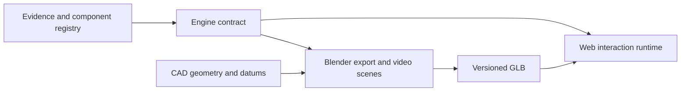

# Scalable engine-platform architecture

The platform has one engineering/teaching core and two adapters. The Blender adapter produces lesson scenes and videos; the web adapter provides interactive inspection. Neither adapter owns engine identity, instance placement, operation phases, or evidence claims.

`data/engine-contracts/gtsio520-h-v5.json` is the first contract. It binds the V5 source scene to the published GLB hash, declares one 720-degree operation state, names the six reusable cylinder instances and the primary-drive and crankcase modules, and defines inspection groups without hard-coding those rules into the page.

The immediate compatibility layer uses selector rules over the existing Blender object hierarchy. This is deliberate transitional metadata. Future CAD/Blender exports must write stable module and instance IDs as GLB extras; the web runtime will then select IDs directly instead of matching names.

To add another engine, create a new engine contract, source/asset release, catalogue/evidence records, and module definitions. The same exporter, contract validator, generic inspection controls, animation mixer, section implementation and lesson UI remain reusable. To add a subsystem, add a module and its interfaces to the engine contract rather than making another standalone page.

The single-cylinder motion profile remains a more detailed module-level contract. It should be made a child module of the engine contract when its verified geometry replaces the inherited V4 cylinder representation. Until then, its valve/cycle details are not silently attributed to the V5 whole-engine export.
