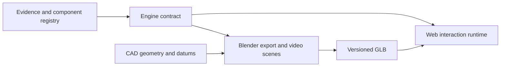

# Scalable engine-platform architecture

The platform has one engineering/teaching core and two adapters. The Blender adapter produces lesson scenes and videos; the web adapter provides interactive inspection. Neither adapter owns engine identity, instance placement, operation phases, or evidence claims.

`web/training.html` is the one interactive training shell. `web/models.json` registers the detailed cylinder and full V5 engine as separate models; `web/model-router.mjs` loads their adapters into the same controls, layout and accessibility structure. `data/engine-contracts/gtsio520-h-v5.json` is the first engine contract. It binds the V5 source scene to the published GLB hash, declares one 720-degree operation state, names the six reusable cylinder instances and the primary-drive and crankcase modules, and defines inspection groups without hard-coding those rules into the page. The same contract holds the 35 teaching-component entries used by the part picker, so learner labels never expose Blender hierarchy paths.

M4 adds a foundation section to that contract: one cylinder template and six instance records; left/right, forward/middle/aft reconstructed stations; an explicit teaching-cycle reference; firing phases derived from the declared 1–4–5–2–3–6 order; the crankcase, crankshaft/bearing and primary-drive interfaces; and an evidence register. The phase records express firing-event spacing (120 degrees), not unverified crank-throw angles or valve timing. Detailed valve/gas operation remains owned by the separate single-cylinder lesson until its evidence is propagated and reviewed for the full engine.

The immediate compatibility layer uses selector rules over the existing Blender object hierarchy. This is deliberate transitional metadata. `export_full_engine_web.py` now writes `engine_id`, `module_id`, and `instance_id` as glTF extras in a future export; the web runtime prefers those stable bindings when they exist and otherwise uses only the contract selector fallback. The currently published, hash-bound V5 GLB does not yet contain those extras, so promotion requires a new validated asset/hash/transport release. The contract also declares a deterministic gzip delivery file and its raw fallback, keeping transport, browser loading, and release validation bound to the same model identity.

To add another engine, create a new engine contract, source/asset release, catalogue/evidence records, and module definitions. The same exporter, contract validator, generic inspection controls, animation mixer, section implementation and lesson UI remain reusable. To add a subsystem, add a module and its interfaces to the engine contract rather than making another standalone page.

The single-cylinder motion profile remains a more detailed module-level contract. It should be made a child module of the engine contract when its verified geometry replaces the inherited V4 cylinder representation. Until then, its valve/cycle details are not silently attributed to the V5 whole-engine export.

M4 is therefore a foundation, not a fidelity sign-off. The contract records the open evidence needed before M5: applicable mounting datums/bank angles, journal-to-bearing map, crank-throw indexing, primary-drive ratios, and whole-engine valve/gas timing. M5 may add connected subsystems only through these interfaces and the same contract; it must not create parallel web or animation rules.
