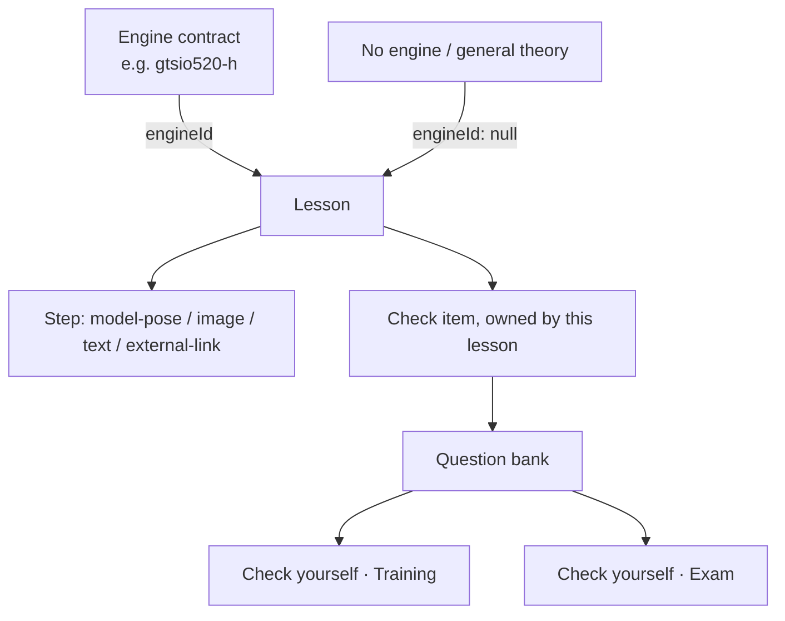
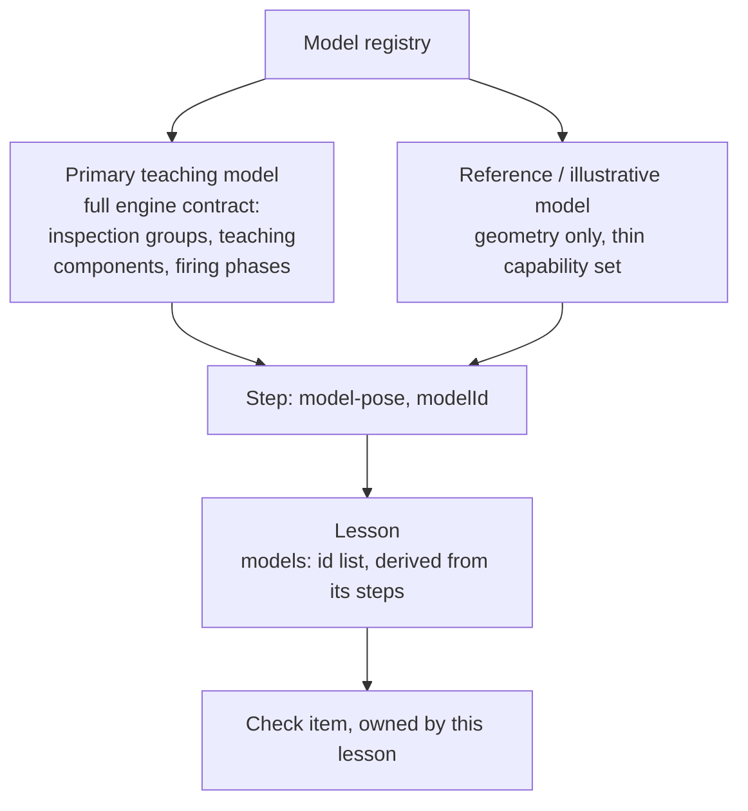

# Lesson and assessment content architecture

Status: proposed and evolving. Captures instructor discussion started 15 September 2026. Not an implementation, not an approval of any milestone — a working design reference to keep decisions from being re-litigated or silently contradicted as Learn and Check yourself grow past the single M2 cylinder lesson.

## Why this document exists

The shell already has three modes (Explore, Learn, Check yourself) and one working example: `web/m2-cylinder-lessons.json`, described in [m2-operating-cylinder-learning-design.md](m2-operating-cylinder-learning-design.md). That file is bound to exactly one model (`model_id: "cylinder"`), mixes lesson steps and check questions in one flat structure, and only supports two step actions (`angle`, `cycle-angle`). The stated long-term intent is broader: several lessons per engine, lessons that describe general theory and are not tied to any one engine, checks that are explicitly owned by a lesson rather than positionally associated with one, and eventual support for more than one engine model on the platform. This document is where that shape gets worked out before it becomes code.

This sits alongside [engine-platform-architecture.md](engine-platform-architecture.md), which already answers the equivalent question for CAD/geometry ("to add another engine, create a new engine contract... the same exporter, contract validator, generic inspection controls, animation mixer, section implementation and lesson UI remain reusable"). The gap this document fills is the same question one layer up, for lesson and assessment *content* rather than geometry. See also [explore-mode-content-architecture.md](explore-mode-content-architecture.md) for the equivalent question about Explore's model/component hierarchy rather than lesson content.

## Curriculum source of truth

Two curriculum breakdowns exist in the repo: [overnight-lesson-preparation-report.md](overnight-lesson-preparation-report.md) (12 Sep, day-based, tied to the actual 9-day master schedule and lesson plans, 12 units) and the syllabus-lesson-mapping walk-through (15–16 Sep, thematic, an 18-lesson list reordered around content logic with explicit sourcing decisions). Confirmed 20 Sep 2026: **the thematic 18-lesson list is authoritative** for lesson content and ordering. The day-based report is not discarded — its two genuinely reusable contributions carry forward:

1. **The lesson-authoring pattern** — opening prompt → student action → feedback → completion evidence. This is a recommended convention for how a lesson's steps are sequenced, not a new schema field: a lesson typically opens with a `text` step (the prompt), followed by `model-pose`/`image`/`web-embed` steps (the action), explanatory `text` (feedback), and — new — a lesson-level `completionCriteria` string, separate from its checks, since the day-based report's "completion evidence" is often narrative ("identify five parts and explain the piston-pin-to-rod-to-crankshaft relationship in order") rather than always a formal multiple-choice check.
2. **Day/calendar mapping** — becomes a secondary, non-ordering field on a lesson (proposed: `scheduledDay?: number`), for classroom scheduling only. It does not drive lesson sequence; the thematic list does.

## Lesson schema, proposed v2

Evolving `4212.lesson-pack/v1` rather than replacing it. Existing files stay valid; new fields are additive.

| Field | v1 today | v2 proposal |
|---|---|---|
| `model_id` | Required, one value, whole file | Renamed `engineId` on the **lesson**, not the file. `null` means the lesson is general/theory and does not require a model. Naming follows the existing `engine_id` used in engine contracts. |
| Steps | `{prompt, action:{type,value}, note}` | Adds a `type` per step: `model-pose` (today's angle/cycle-angle action), `image`, `text`, `external-link`. A lesson can freely mix types — e.g. a maintenance-procedure lesson might be mostly `image` + `text` with no model step at all. |
| Checks | Flat top-level array, associated with a lesson only by file position | Each check gets an explicit `lessonId` reference. Checks become independently addressable so the same or a related question can appear in a lesson's inline retry-until-correct check *and* in the Check-yourself question bank without duplication. |

Design principle, stated directly by the instructor: **Learn is not meant to be question-dense.** Most steps present ideas in a logical, visual, easy-to-follow order (model pose, image, or short text); checks are used sparingly, as occasional retrieval moments, not as the backbone of the lesson. The schema should make a checkless lesson (or one with a single check) just as natural as the current five-check example — a lesson is not required to end in a quiz.

## Lesson schema, proposed v3

Confirmed 17 Sep 2026, evolving v2 further rather than replacing it. Raised by a concrete case: a history lesson that wants to show the actual Wright 1903 engine, which is not the course's teaching subject (GTSIO-520-H) and does not need the full engine-contract machinery that model gets. v2's `engineId` is singular and lesson-scoped, which can't express "zero models," "one model," and "several different models across different steps" as the same kind of thing — v3 makes that the norm rather than an edge case.

| Field | v2 | v3 proposal |
|---|---|---|
| Lesson-level model reference | `engineId: string \| null`, one value for the whole lesson | `models: string[]` — every model id referenced anywhere in the lesson's steps. Empty array replaces `engineId: null`; a general/theory lesson is no longer a special case, just a lesson whose derived model list happens to be empty. |
| Step-level model reference | Implicit — a `model-pose` step acted on whatever the lesson's single `engineId` pointed at | Explicit `modelId` on every `model-pose` step, which must be one of the lesson's declared `models`. Different steps in the same lesson can now target different models. |
| Model registry entries (`src/data/models.json`) | Undifferentiated — every registered model implicitly assumed to carry the same capability set as GTSIO-520-H | Each entry selects an adapter. The adapter returns only its supported viewer features. A **primary teaching model** carries the full engine contract and controls; a **reference/illustrative model** can register with geometry, camera controls and hotspots only. |
| Step types | `model-pose`, `image`, `text`, `external-link` | Adds `web-embed`: an animated 2D illustration (e.g. an animated Otto-cycle PV diagram, an oil-flow schematic) for cases where 3D is unnecessary overhead and a static `image` is insufficient. |

**Implementation status (29 Sep 2026):** the v3 lesson packs remain public data under `web/` and the unified React application consumes them through `loadProductionData.ts`. The canonical model registry is `src/data/models.json`. Every `model-pose` step is rendered by `LessonMedia.tsx` through the same `ModelViewer` used by Explore, selecting `lesson-dynamic` or `lesson-reference` from the adapter type and passing the declared action, view preset and hotspot focus. Types and structural validators remain in `web/schema/content-schema.mjs`.

**Explore-mode implication:** viewer chrome is no longer fixed to "whatever GTSIO-520-H supports." When a step loads a reference model with `hasTeachingComponents: false`, Explore hides or disables the component search / isolation / section controls that model doesn't back, rather than showing controls that do nothing. This was implicit before since only one model existed on the platform; it becomes a real UI rule once reference models exist alongside it.

**Learn-mode implication, confirmed 21 Sep 2026:** a `model-pose` step gets an additional optional `focusNodeId`, referencing a node in that model's component/group tree ([explore-mode-content-architecture.md](explore-mode-content-architecture.md)) — a component or a group. When set, Learn shows a deliberately reduced control set scoped to that one node (not the full Explore sidebar), so a valve-train step shows the valve-train grouping, not a searchable picker over all 60 parts. Every Learn viewer carries a persistent "Explore this fully →" link that switches to Explore mode preserving current model/camera/section state (per the existing shared-model-state decision), handing the student to full free-roam controls if they want to go further on their own.

## Deep dives — cross-cutting optional content

Confirmed 21 Sep 2026, simplified same day. Steps stay simple and strictly linear within a lesson. Separately, a **deep dive** covers material that either elaborates on one lesson beyond what its linear flow needs, or cuts across several lessons/topics (e.g. a materials-science page relevant to both Parts and Construction and Maintenance and Servicing) — reached only via an explicit link inside a lesson step, for self-directed immersion, never required to progress.

A deep dive is **not a separate entity type** — it's an ordinary `Lesson`, distinguished only by an added `listed` flag (default `true`) that controls whether it appears in Learn's main browsable list. A deep-dive lesson sets `listed: false`: it has the full `Lesson` shape (steps, optional checks, optional `completionCriteria`), it just isn't surfaced at the top level. A lesson step gains an optional `deepDiveLinks?: string[]` referencing other lesson ids (which must have `listed: false`), rendered as "want to go deeper?" links. Because a deep dive is a full lesson, it can own checks like any other — no special case needed for that.

## Learn top-level navigation

Confirmed 21 Sep 2026: a flat, scrollable list of all 18 lessons — no grouping/theming layer, no prerequisite gating. A student may open any lesson in any order. The list itself can be hidden/shown (mirroring Explore's "Hide controls" pattern) so the model can take the full viewport when the list isn't needed. Deep dives, per above, are deliberately excluded from this list — they only surface as in-lesson links.

**Superseded, 21 Sep 2026 (same day, later session):** the flat-list-only decision above is reversed. Learn (and Check yourself) now group lessons by their owning pack, and each pack is a first-class, browsable "track" with its own `id`/`title`/`description` shown as a gallery card before drilling into that track's lesson list. This was driven by unifying `training.html`'s single-hardcoded-model Explore/Learn/Check shell with the separate `learn.html` general-syllabus page into one app: `web/lessons-manifest.json` already existed to concatenate multiple lesson packs, but only listed `history-lessons.json`; `m2-cylinder-lessons.json` (the M2 four-stroke lesson, previously reachable only through `training.html`'s own bespoke panel) is now a second pack in that manifest, and is a "track" in exactly the same sense — a pack with one lesson instead of many. Check yourself gained the equivalent gallery: a flat list of every lesson (across every pack) that owns at least one check, which also finally surfaced `history-lessons.json`'s 6 checks that no UI could reach before. Within a track, lessons are still a flat, ungated list — only the top level gained a grouping layer. Deep dives stay excluded from both the track lesson list and the top-level gallery, unchanged.

## Progress persistence — amends the privacy commitment

Confirmed and worded precisely 21 Sep 2026: **lesson-completion progress may persist locally on the student's device** (e.g. `localStorage`) so a student doesn't lose their place across 18 lessons, while remaining **never transmitted**. This is narrower than "not transmitted or stored," which `docs/ROADMAP.md`'s Training-modes section used to state as the platform-wide default — that line is now updated to distinguish lesson progress (may persist locally, never transmitted) from Check yourself results (session-only, no persistence at all, local or otherwise). `docs/m2-operating-cylinder-learning-design.md`'s "Implementation status" wording is untouched and still accurate: it specifically describes the current M2 Check-yourself feature, which has zero persistence today, and this decision doesn't change that. The user explicitly named the amendment as a deliberate first step toward eventual cross-device sync (a Brilliant-style account model), not a privacy regression — see the login/accounts item already parked in the roadmap.

**Worked example — History of Mechanical Engines / History of Aircraft Engines:** both are ordinary lessons under this schema, not a special "timeline" lesson type (an earlier framing this supersedes). Most steps are `text`/`image` narrative beats contributing nothing to `models`. The one moment that earns a model — a student rotating the actual Wright Flyer engine — is a single `model-pose` step with `modelId: "wright-1903-engine"`, pointing at a reference/illustrative registry entry with a thin capability set (orbit, zoom, reset and guided hotspots; no section or isolation). Static references use `viewPreset` instead of inventing an animation `action`. No separate lesson type and no separate viewer mode; the flexibility lives entirely in the schema.

## Check yourself: two modes

Both modes draw from the same lesson-owned question bank; they differ only in interaction flow.

| | Training | Exam |
|---|---|---|
| Feedback timing | Immediate per question (lock-and-reveal: wrong answer shows the correct one and its rationale right away, matching the Paper mockup already built) | Withheld until the end of the session |
| Timer | None | Timed, one budget for the whole set, not per-question |
| Navigation | Linear, one question at a time | Free navigation between questions before submitting, like a real exam paper |
| On time expiry | N/A | Auto-submit whatever is answered |
| Results | N/A, feedback is inline | A summary score plus a full per-question review with rationale, shown only after submit/time-up |
| Privacy | Session-only, matches existing stance | Same: results computed and shown locally for this session only, never transmitted or persisted, consistent with the existing "no learner identity, answers, or completion state are transmitted or stored beyond the page session" commitment in the M2 design |

Confirmed 15 Sep 2026 — all four Exam-mode rows above.

**Answer changes before submit, confirmed 21 Sep 2026:** allowed in Exam mode (a student can revisit and change any answer until they submit the whole set). Not allowed in Training mode — once an option is selected, it locks immediately (matching the existing lock-and-reveal behavior). Rationale, stated directly: Training's value is giving the student an honest, unhedged read of their own understanding in the moment, which a changeable answer would undermine.

**Review scope, confirmed 21 Sep 2026:** per-lesson only. A Check yourself session draws from exactly one lesson's owned checks; there is no cross-lesson or whole-unit assembly (the earlier open question above is resolved this way — see "Resolved" below).

**Entry point, confirmed 21 Sep 2026:** both. Check yourself is a standalone tab with its own list (a student can independently pick any lesson to review, mirroring Learn's flat list), *and* the shell nudges a student toward it — after finishing a lesson, and again after finishing the whole module — without forcing it.

## Question types

Confirmed 21 Sep 2026: the check schema should plan for several question types now, each with its own shape, rather than assume multiple-choice is the only kind forever. A `CheckItem` carries the fields common to every type (`id`, `lessonId`, `type`, `prompt`, optional `hint`, `rationale`) plus type-specific fields:

| Type | Type-specific fields | Use |
|---|---|---|
| `multiple-choice` | `options: string[]`, `correctIndex: number` | The existing pattern. Also covers true/false as the two-option case — no separate type needed since the shape is identical. |
| `model-click` | `modelId: string`, `correctNodeId: string` | "Click the component on the model" — `correctNodeId` references a node in that model's component/group tree ([explore-mode-content-architecture.md](explore-mode-content-architecture.md)), so this type reuses Explore's tree rather than inventing a parallel identity scheme. |
| `ordering` | `items: string[]` (already in correct order; the UI shuffles for display) | Sequencing tasks — e.g. "sequence the valve train," ordering historical milestones. |
| `matching` | `pairs: { left: string, right: string }[]` | Pairing tasks — e.g. component → function. |
| `numeric` | `unit: string`, `correctValue: number`, `tolerance?: number` | Calculation checks — e.g. a compression-ratio or displacement result for Performance Calculations, where an exact-string match is the wrong comparison. |

This is a starting set grounded in activities already sketched elsewhere in the repo (the day-based report's valve-train sequencing and worked-calculation ideas), not a closed list — a new type can be added the same way if a specific lesson needs one that doesn't fit these five.

## Decisions log

- **21 Sep 2026** — Check yourself: review scope is per-lesson only; it's both a standalone tab with its own list and something the shell nudges toward after a lesson/module completes; answers can be changed before submit in Exam mode but lock immediately in Training mode; the check schema plans for five question types (`multiple-choice`, `model-click`, `ordering`, `matching`, `numeric`) from the start rather than assuming multiple-choice only.
- **21 Sep 2026** — Deep dives are ordinary lessons with `listed: false`, not a separate entity type — simplified from the same-day original proposal of a standalone `DeepDive` type.
- **21 Sep 2026** — Steps stay simple/linear; cross-cutting or elaborative content becomes a separate, optional "Deep dive" entity linked from within a step, not a branching step graph.
- **21 Sep 2026** — Learn's top-level navigation is a flat, hideable, ungated list of all lessons — no theming/grouping layer, no prerequisites, free browse order.
- **21 Sep 2026** — Lesson-completion progress persists locally on-device (not transmitted), amending the stricter "not transmitted or stored" wording used for the current M2 feature — see the note above for exactly what stays accurate where.
- **21 Sep 2026** — A `model-pose` step may set `focusNodeId` to scope Learn's viewer to one component or group from that model's tree, with a persistent link back to full Explore mode.
- **21 Sep 2026** — Lesson images follow the existing Drive-synced asset pattern (same as GLBs), not repo-committed files. `external-link` steps open in a new tab (revisitable later if inline embedding turns out to matter more).
- **20 Sep 2026** — The 15–16 Sep thematic 18-lesson list is the authoritative curriculum order, superseding the 12 Sep day-based report's ordering. The day-based report's opening-prompt/student-action/feedback/completion-evidence blueprint pattern and its day/calendar mapping both carry forward as noted above, rather than being discarded.
- **15 Sep 2026** — All four Exam-mode interaction defaults confirmed as written (whole-session timer, free navigation before submit, auto-submit on expiry, full score-plus-review results at the end).
- **17 Sep 2026** — Lesson-level model reference becomes plural (`models: string[]`) instead of a single nullable `engineId`; `model-pose` steps get an explicit `modelId`. Rationale: a lesson can legitimately reference zero, one, or several models (e.g. a history lesson showing the Wright 1903 engine alongside narrative content unrelated to GTSIO-520-H), and forcing that through one lesson-scoped `engineId` couldn't express it. Also adds capability flags to model registry entries so lightweight reference/illustrative models don't need to fake the full engine-contract feature set, and adds a `web-embed` step type for animated 2D illustrations that don't warrant a 3D model. Superseded framing: an earlier "timeline lesson type" proposal for history lessons, no longer needed once models are optional and per-step rather than mandatory and lesson-wide.
- **15 Sep 2026** — Retry-until-correct for checks embedded in a Learn step; lock-and-reveal (no retry) for Check yourself. Rationale: Learn's checks are formative and low-stakes by design; Check yourself's Training mode is the dedicated self-review surface where seeing the right answer immediately still fits, and Exam mode raises the stakes further by withholding feedback entirely until the end.
- **15 Sep 2026** — Check yourself gets Training and Exam sub-modes rather than one fixed quiz behavior.
- **13 Sep 2026** — Reveal in Learn is not gated on typing a prediction; free-text prediction is an invitation, not a requirement (matches the no-tracking, self-directed stance already documented for M2).
- **13 Sep 2026** — Model state (camera, section, crank angle) is shared and persists across Explore/Learn/Check tabs — already true in the current shell per the M2 design doc's "the crank-angle slider is the lesson's source of truth," now confirmed as the intended behavior going forward rather than an implementation detail.

## Open questions, not yet resolved

- What minimal shape a reference/illustrative model registry entry needs (v3). It clearly doesn't need the full engine-contract fields (inspection groups, teaching components, firing phases), but hasn't been defined down to a concrete schema yet — just the capability-flag concept.
- Where reference-model assets (Wright 1903, a generic steam engine, etc.) get sourced or modeled from, and at what fidelity — a content/production question the schema doesn't need to answer, but that gates actually populating `models` for the history lessons.

## Resolved (previously open)

- **Check yourself review scope** — resolved 21 Sep 2026: per-lesson only, not cross-lesson/whole-unit assembly.
- **Which curriculum breakdown is authoritative** — resolved 20 Sep 2026: the thematic 18-lesson list, with the day-based report's blueprint pattern and day-mapping folded in as noted above.
- **Exam-mode timer/navigation/results defaults** — resolved 15 Sep 2026, confirmed as originally proposed.
- **How a general/theory lesson renders "model" steps** — resolved by v3: `models: []` is just the natural empty case, not a special disclosure-needing state. A lesson only shows a model step if one of its steps explicitly declares a `modelId`; there's no more "borrowing" another engine's model with a generalization caveat.

## Related, deliberately out of scope here

User accounts/login, an AI/MCP-assisted tutor with audio conversation, and expansion beyond this module to other aircraft systems were raised in the same discussion. Accounts are already covered by the roadmap's parking lot ("Student accounts, grade storage and LMS integration are outside the initial public teaching release unless separately requested"). The AI-tutor and multi-module ideas are new; see the roadmap parking lot for where they now live.

## Spotlighting parts in a model step

A `model-pose` step can point the learner at some parts with `focusParts` (component ids from the model's catalogue, or the teaching-component ids for the full engine) and choose how the rest of the model is drawn with `focusMode`:

| `focusMode` | The spotlit parts | Everything else | Best for |
|---|---|---|---|
| `highlight` | coloured teal | plain pale grey, solid | an outside part whose place in the whole matters |
| `xray` (default) | as they normally look | a faint see-through grey | parts hidden behind others, shown in context |
| `isolate` | as they normally look | hidden | inspecting one part or group on its own |

Choose by what the learner can see: highlight only reads for parts visible from the camera, so use `xray` or `isolate` for internal parts. `focusMode` needs `focusParts`, and the schema test rejects it without them. The viewer reports whether a spotlight is active and its mode, and offers `features.focus.setMode()` so a student-facing switch can change the look for the current step; the next step starts again from its own `focusMode`. The rules live in `src/viewer/core/focus-style.mjs`.
