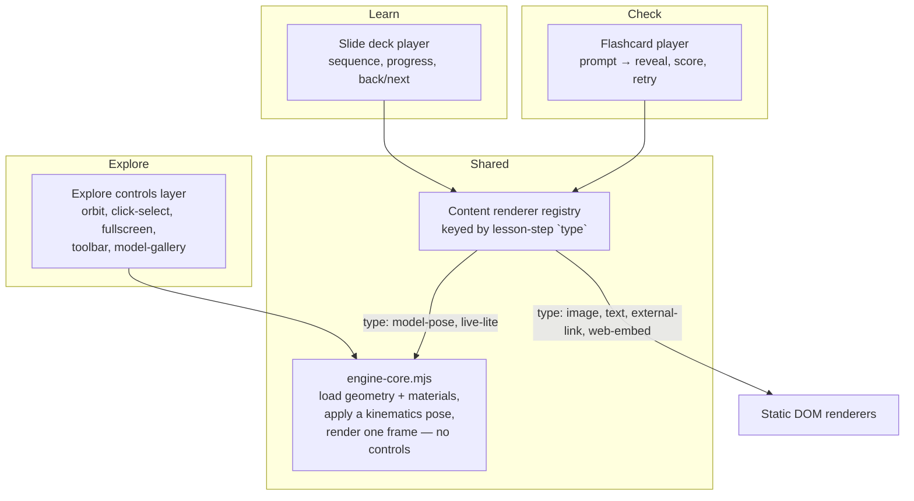

# Explore/Learn/Check shell and viewer separation

Status: **implemented, 22 September 2026.** Captures instructor discussion from the same day; the migration sequence below ran the same session it was written. Superseded the claim in [engine-platform-architecture.md](engine-platform-architecture.md) that `web/training.html` is "the one interactive training shell" — that file is now retired; `explore.html`/`learn.html`/`check.html` are three real pages (see "Physical shape" below, now updated to reflect what shipped rather than what was proposed).

## Why this document exists

Explore, Learn and Check yourself currently all route through the same `web/training.html` page and the same `#view` Three.js canvas:

- `web/model-router.mjs` always imports `viewer.js` (or `engine-training-adapter.mjs`) before it looks at `mode` at all — the 3D engine boots regardless of which mode the student lands on.
- `web/training-modes.mjs`'s `showExplore()`/`render()` only toggle the `hidden` attribute on `#guided-mode`; nothing ever hides, pauses or disposes `#view`. The sticky 3D canvas stays mounted and rendering underneath Learn and Check the entire time.
- `training-modes.mjs` is 411 lines doing routing, Learn's slide state, and Check's flashcard state all in one file, keyed off a single `mode` variable.

This produces the wrong mental model for what each mode actually is:

| Mode | What it actually is | What it should not be |
|---|---|---|
| Explore | A 3D game — persistent scene, orbit, click-select, inspection | — |
| Learn | A slide deck — logical sequence of ideas, of which some slides may show a 3D pose | A dedicated 3D viewer that happens to also show slides |
| Check yourself | Flashcards — prompt, reveal, retry | Another 3D viewer with quiz chrome bolted on |

Not every lesson has 3D content at all (a maintenance-procedure or general-theory lesson may be entirely `image`/`text`), so Learn and Check must not pay the cost of instantiating a full WebGL scene by default.

## Proposed architecture

Three layers, not three viewers:

1. **`engine-core.mjs`** — pure scene construction: load a model's geometry, apply a kinematics pose via `kinematics.mjs`/`valve-transforms.mjs` (and, since the M2 lesson needs it, `cycle-visuals.mjs`), render at a fitted camera. No orbit controls, no click-to-select, no toolbar, no model-gallery. Exposes `createEngineCore(container, {assetUrl, motionProfileUrl, angle})` → `{setPose(angle, {cycle}), dispose(), hasMotion}`. **Deviation from the plan**: this is a new, independent module, not literally carved out of `viewer.js` — `viewer.js` still has its own duplicate scene/camera/renderer setup. A true extraction would need `engine-core.mjs` to expose `scene`/`camera`/`meshes`/`root` for Explore's orbit/selection/section-cutting to build on, which is a real capability change to the module, not a refactor; deferred as a follow-up since it's pure cleanup, not a functional requirement (Explore and Learn both work correctly and independently either way).
2. **Explore controls layer** (`viewer.js`, unchanged apart from the pose-handoff addition below) — orbit, selection/inspection panel, section-cutting, fullscreen, toolbar, model-gallery. Explore-only; this is the only place a student free-roams the model. Lives on its own page, `explore.html`.
3. **Content renderers**, keyed by the lesson-step `type` values from [lesson-and-assessment-architecture.md](lesson-and-assessment-architecture.md) (`model-pose`, `image`, `text`, `external-link`, `web-embed`) — `renderGenericStepBody`/`renderModelPoseBody` in `guided-shared.mjs`. Learn's slide-deck player (`learn-modes.mjs`) and Check's flashcard player (`check-modes.mjs`) both consume them; they differ only in their outer interaction shell (sequential vs. prompt/reveal), not in how a given step type gets drawn. A `model-pose` step mounts a live-lite `engine-core.mjs` instance (fixed camera, single pose, no controls); every other step type is a plain DOM renderer with no WebGL involved. **Simplification found during implementation**: a `model-pose` step's live-lite instance now always loads whatever model its own `modelId` names, resolved independently through the registry — it no longer needs to match "the model this page has loaded" (that concept doesn't exist for Learn/Check anymore, see below), so the old same-model-vs-cross-model branching and its "open in a new tab" fallback link are gone. A step only falls back to a placeholder if its `modelId` genuinely isn't in the registry or has no asset yet.

This is the (b) choice from the discussion — live-lite fidelity for `model-pose` steps, not baked images — because it reuses the kinematics modules directly and keeps visual consistency with Explore.

## Live-lite lifecycle: one WebGL context at a time

A live-lite `model-pose` instance and Explore's full instance never coexist — Explore is now on its own page (`explore.html`), so a normal navigation away from it already tears its Three.js scene down; there's nothing left to coordinate there. Within Learn, `guided-shared.mjs` holds the one live-lite instance as module state (`disposeInstance`/`disposeLiveViewer`), keyed by which model it's currently showing, and disposes it before mounting a different one. A generation counter guards the async mount against a student navigating away mid-load. Found and fixed one bug here during implementation: the internal reuse check inside `ensureLiveViewer` was calling the full `disposeLiveViewer` (which also hides/clears the DOM container) on every first mount, immediately undoing the `hidden = false` the caller had just set — split into an internal `disposeInstance` (state only) and the exported `disposeLiveViewer` (state + hide/clear container, used only when leaving Learn's model-pose steps entirely).

The "Explore this fully" button (`guided-explore-link`) now does a real navigation: `location.href = './explore.html?model=<id>&angle=<value>&cycle=1'`. `viewer.js` reads `?angle=`/`?cycle=` once its motion profile loads and jumps straight there instead of the profile's default bind pose — the only functional change made to `viewer.js` this migration; everything else about Explore is untouched.

## Physical shape: three static entry points, no build step

Confirmed by checking `.github/workflows/pages.yml`: there is no bundler, no `package.json`, no build step at all. CI runs `node --test` against the kinematics/lesson-pack/schema test files and a couple of Python asset-contract checks, then uploads `web/` to GitHub Pages as-is. Three.js still loads straight from the jsdelivr CDN via an `importmap`, now declared independently on each of the three pages that need it (`explore.html`/`learn.html`/`check.html` all declare it, since any of them may end up loading `engine-core.mjs`).

Introducing Vite/esbuild purely to get HTML includes would have been a bigger change than the one being made, so instead:

- `explore.html`, `learn.html`, `check.html` — three real entry points. All CSS lives in one shared `shell.css` (extracted verbatim from the old `training.html` stylesheet, rather than hand-partitioned three ways — safer given no automated visual regression coverage exists). App-bar/dialog *markup* is still hand-authored per page (small enough, ~15 lines, that a runtime-injection abstraction wasn't worth the added indirection); `page-shell.mjs` (renamed from `training-shell.mjs`) is the one shared piece of *behavior* — dialog open/close, reduced-motion, and `initPageShell(mode, modelId)`, which marks the current nav tab and forwards `?model=` onto the other two links.
- `web/index.html` and `web/engine.html` now redirect to `explore.html`; `web/learn.html`'s old redirect-to-`training.html` shim is gone because `learn.html` is now the real page.
- `web/training.html`, `web/training-modes.mjs`, `web/model-router.mjs` and `web/training-shell.mjs` are deleted. `web/explore-router.mjs` replaces `model-router.mjs`'s role for Explore only; `web/guided-shared.mjs` + `web/learn-modes.mjs` + `web/check-modes.mjs` replace `training-modes.mjs`, split so neither Learn nor Check statically imports Explore's viewer or Three.js — `scripts/test_training_shell.mjs` now asserts that directly.
- Learn and Check turned out not to need a `?model=` URL parameter at all: since a `model-pose` step resolves its own model independently (see above), there's no page-level "current model" left to track on those two pages — only Explore has one.

## What does not change

- Lesson pack schema (`4212.lesson-pack/v3`), the model registry (`web/models.json`), and the kinematics math modules (`kinematics.mjs`, `valve-kinematics.mjs`, `cycle-cues.mjs`) are unaffected — this is a rendering-layer split, not a content-schema change.
- Three.js remains the only 3D engine (`project.json`'s `preferred_architecture.viewer`); `engine-core.mjs` is a narrower entry point into the same library, not a new stack.
- Check's data model (checks addressable by `lessonId`, per `lesson-and-assessment-architecture.md`) is unchanged; only how a check's illustration renders is affected.

## Migration sequence (all done, 22 Sep 2026)

1. ✅ Add `engine-core.mjs` as a new, independent module (not a literal extraction — see deviation noted above). Explore (`viewer.js`) verified unchanged.
2. ✅ `guided-shared.mjs`'s `renderGenericStepBody` handles non-`model-pose` steps; `learn-modes.mjs`/`check-modes.mjs` both call into it.
3. ✅ `model-pose` steps wired to a live-lite `engine-core.mjs` mount via `ensureLiveViewer`/`disposeLiveViewer`, generation-guarded.
4. ✅ `explore.html`/`learn.html`/`check.html` split out; `shell.css` + `page-shell.mjs` shared; "Explore this fully" does a real `?model=&angle=&cycle=` handoff.
5. ✅ `training.html`, `training-modes.mjs`, `model-router.mjs`, `training-shell.mjs` deleted; `index.html`/`engine.html` redirects updated; `scripts/test_training_shell.mjs` rewritten against the new files.

Verified against a local static server for both models (`cylinder` and `gtsio520-h-v5-teaching-engine`), all three pages, the M2 lesson's `angle` and `cycle-angle` steps, the text/image-only History & Fundamentals pack (confirmed zero canvases, no Three.js load), both Check question types, and the full `node --test` suite (20/20).

## Open items

- `engine-core.mjs`/`viewer.js` still duplicate scene-setup code (see deviation note under "Proposed architecture") — real cleanup, not urgent, since both work correctly independently.
- `engine-training-adapter.mjs` (the full six-cylinder engine) doesn't read `?angle=`/`?cycle=` yet — only `viewer.js` does, because no lesson currently targets that model. Add it there if/when a lesson does.
- Whether `external-link`/`web-embed` steps need any sandboxing beyond what `dialog`/`iframe` defaults give — out of scope for this document.
