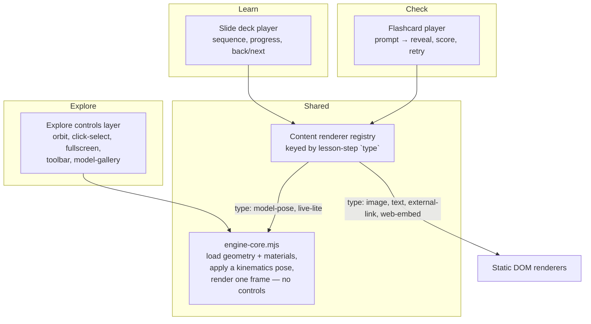

# Explore/Learn/Check shell and viewer separation

Status: proposed, not yet implemented. Captures instructor discussion, 22 September 2026. This is the plan `viewer.js` and `training-modes.mjs` will be split against — written up first so the split isn't re-litigated mid-refactor. Revises one claim in [engine-platform-architecture.md](engine-platform-architecture.md): `web/training.html` is described there as "the one interactive training shell" for all three modes; this document proposes retiring that in favor of three separate shells (see "Physical shape" below).

## Why this document exists

Explore, Learn and Check yourself currently all route through the same `web/training.html` page and the same `#view` Three.js canvas:

- `web/model-router.mjs` always imports `viewer.js` (or `engine-training-adapter.mjs`) before it looks at `mode` at all — the 3D engine boots regardless of which mode the student lands on.
- `web/training-modes.mjs`'s `showExplore()`/`render()` only toggle the `hidden` attribute on `#guided-mode`; nothing ever hides, pauses or disposes `#view`. The sticky 3D canvas stays mounted and rendering underneath Learn and Check the entire time.
- `training-modes.mjs` is 411 lines doing routing, Learn's slide state, and Check's flashcard state all in one file, keyed off a single `mode` variable.

This produces the wrong mental model for what each mode actually is:

| Mode | What it actually is | What it should not be |
|---|---|---|
| Explore | A 3D game — persistent scene, orbit, click-select, inspection | — |
| Learn | A slide deck — logical sequence of ideas, of which some slides may show a 3D pose | A dedicated 3D viewer that happens to also show slides |
| Check yourself | Flashcards — prompt, reveal, retry | Another 3D viewer with quiz chrome bolted on |

Not every lesson has 3D content at all (a maintenance-procedure or general-theory lesson may be entirely `image`/`text`), so Learn and Check must not pay the cost of instantiating a full WebGL scene by default.

## Proposed architecture

Three layers, not three viewers:

1. **`engine-core.mjs`** (new, carved out of today's `viewer.js`) — pure scene construction: load a model's geometry, apply materials, drive a pose through `kinematics.mjs`/`valve-kinematics.mjs`, render at a given camera. No orbit controls, no click-to-select, no toolbar, no model-gallery. Exposes `mount(container, {modelId, angle, camera})`, `setPose(angle)`, `dispose()`.
2. **Explore controls layer** (what's left of `viewer.js` after the extraction) — wraps `engine-core.mjs` and adds everything interactive: orbit, selection/inspection panel, fullscreen, toolbar, model-gallery. Explore-only; this is the only place a student free-roams the model.
3. **Content renderer registry**, keyed by the lesson-step `type` values already defined in [lesson-and-assessment-architecture.md](lesson-and-assessment-architecture.md) (`model-pose`, `image`, `text`, `external-link`, `web-embed`). Learn's slide-deck player and Check's flashcard player both consume this registry — they differ only in their outer interaction shell (sequential vs. prompt/reveal), not in how a given step type gets drawn. A `model-pose` step mounts a live-lite `engine-core.mjs` instance (fixed camera, single pose, no controls); every other step type is a plain DOM renderer with no WebGL involved.

This is the (b) choice from the discussion — live-lite fidelity for `model-pose` steps, not baked images — because it reuses the kinematics modules directly and keeps visual consistency with Explore.

## Live-lite lifecycle: one WebGL context at a time

A live-lite `model-pose` instance and Explore's full instance must never both be mounted. Rule: whichever mode-shell is active owns the only `engine-core.mjs` instance in the page; switching away from a `model-pose` slide, or leaving Learn/Check entirely, calls `dispose()` before anything else mounts.

The existing "Explore this fully" link (`guided-explore-link` → `setMode('explore')` in `training-modes.mjs:377`) already has the right intent — it needs to carry the current model and pose forward so Explore opens oriented where the slide left off, e.g. `explore.html?model=cylinder&angle=270`, instead of just switching an in-page mode flag.

## Physical shape: three static entry points, no build step

Confirmed by checking `.github/workflows/pages.yml`: there is no bundler, no `package.json`, no build step at all. CI runs `node --test` against the kinematics/lesson-pack/schema test files and a couple of Python asset-contract checks, then uploads `web/` to GitHub Pages as-is. `web/training.html` loads Three.js straight from the jsdelivr CDN via an `importmap`.

Given that, introducing Vite/esbuild purely to get HTML includes would be a bigger change than the one already being made. Instead:

- `explore.html`, `learn.html`, `check.html` — three real entry points, each a thin shell.
- A shared shell-injection module (extending what `training-shell.mjs` already does for dialogs/reduced-motion) injects the common app-bar, mode-tabs nav, and settings/about dialogs into each page at load time, so the chrome markup isn't hand-duplicated three times over.
- `web/index.html` and `web/learn.html`'s current redirect-to-`training.html` shims go away; each mode is a direct URL.
- `web/training.html` itself is retired once `explore.html` takes over its role (Explore keeps the full controls layer; it's the same page under a clearer name, not a fourth page).

## What does not change

- Lesson pack schema (`4212.lesson-pack/v3`), the model registry (`web/models.json`), and the kinematics math modules (`kinematics.mjs`, `valve-kinematics.mjs`, `cycle-cues.mjs`) are unaffected — this is a rendering-layer split, not a content-schema change.
- Three.js remains the only 3D engine (`project.json`'s `preferred_architecture.viewer`); `engine-core.mjs` is a narrower entry point into the same library, not a new stack.
- Check's data model (checks addressable by `lessonId`, per `lesson-and-assessment-architecture.md`) is unchanged; only how a check's illustration renders is affected.

## Migration sequence

1. Extract `engine-core.mjs` from `viewer.js`; keep Explore working against it unchanged (controls layer wraps core, behavior identical to today).
2. Build the content renderer registry and point Learn's existing slide logic at it for non-`model-pose` steps first (lowest risk — no WebGL involved).
3. Wire `model-pose` steps to a live-lite `engine-core.mjs` mount, with the dispose-before-mount lifecycle rule enforced centrally (one place, not per-caller).
4. Split `explore.html`/`learn.html`/`check.html` out of `training.html`, move the shared chrome into the shell-injection module, update the "Explore this fully" link to a real URL handoff with model+angle.
5. Retire `training.html`'s multi-mode branching and the old redirect shims once all three pages are live.

## Open items

- Exact shape of the shell-injection module's API (what markup it owns vs. what each page still authors itself) — not decided here, decide when step 4 starts.
- Whether `external-link`/`web-embed` steps need any sandboxing beyond what `dialog`/`iframe` defaults give — out of scope for this document.
