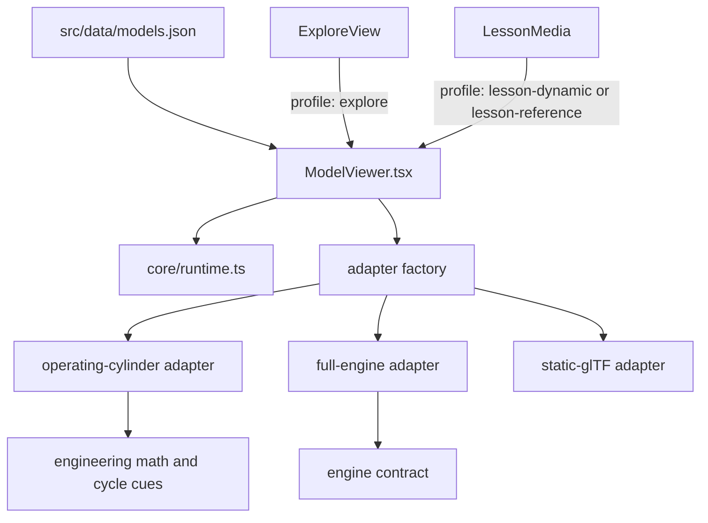

# Unified 3D viewer architecture

Status: implemented 29 September 2026.

The application has one React 3D viewer. Explore, lesson poses, static references and dynamic lesson poses are profiles of that component, not separate pages or renderer implementations.

## Responsibilities

- `src/viewer/ModelViewer.tsx` owns the shared React presentation: load/error state, keyboard support, camera actions, capability-driven panels, lesson overlays and the Explore handoff.
- `src/viewer/core/runtime.ts` is the only scene infrastructure layer. It creates and disposes the Three.js scene, camera, renderer, lighting, OrbitControls, resize observer, picking and render loop.
- `src/viewer/core/assets.ts` owns local/Drive candidates, progress reporting, gzip decoding, GLB validation and GLTF parsing.
- `src/viewer/adapters/` contains model-specific binding only. An adapter receives an existing runtime and returns a `ViewerSession` describing the features that model actually supports.
- `src/viewer/engineering/` contains the reusable kinematics, valve transforms and four-stroke visual calculations. It has no page or React dependency.
- `src/data/models.json` is the single model registry. `modelRegistry.ts` supplies its TypeScript contract and lookup helpers.

## Profiles and capabilities

`explore` enables orbit/pan and exposes every feature returned by the adapter. `lesson-dynamic` and `assessment` lock free camera interaction and render the requested mechanism pose. `lesson-reference` retains a small static-model camera and the lesson-selected hotspots.

The UI is capability-driven rather than model-name-driven. A static reference adapter returns hotspots but no component, motion, section or appearance feature, so those panels are absent. The operating-cylinder and full-engine adapters return their supported controls through the same session interface. A future adapter can add a model without creating another page or copying the viewer shell.

## Lifecycle and navigation

The viewer mounts directly in React; there are no viewer iframes. A profile or model change aborts pending fetches, disposes the previous session, tears down renderer resources and mounts the next adapter. Lesson steps pass `modelId`, initial angle/cycle state, view preset and hotspot focus into the same component. “Explore fully” changes application state while preserving the selected model identity.

The old `web/*.html` entry points, vanilla controllers, duplicate Three.js runtimes and separate reference viewer were removed. `web/` remains Vite's public data/asset directory for lesson packs, contracts, catalogues, motion data, audio, images and the bundled Wright GLB.

## Extension path

To add a model:

1. Add one registry record in `src/data/models.json`.
2. Reuse `static-gltf`, `operating-cylinder` or `full-engine`, or add a new adapter implementing `ViewerSession`.
3. Return only the feature interfaces the model supports.
4. Add adapter/registry validation and, where possible, exercise it in both Explore and a lesson profile.

Do not add another HTML entry point, iframe bridge, renderer, camera-control implementation or model-specific React viewer.

## Verification

`npm run lint`, `npm test` and `npm run build` validate the typed integration, engineering calculations, lesson/schema data, registry, viewer boundaries and production bundle. `scripts/test_training_shell.mjs` is intentionally an architecture regression test: it prevents the retired shells and duplicate viewer components from returning.
